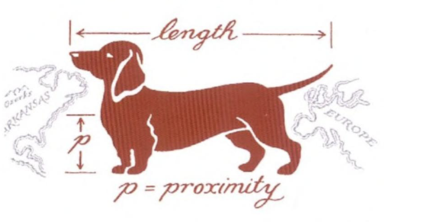

---

<!-- ##### Download

+ [Paper](paper2.pdf)
+ [Online appendix](appendix2.pdf)
+ [Code and data](https://github.com/pmichaillat/wunk-model)

--- -->

(Paper work in progress)

##### Abstract

Interstate borders create a natural experiment in public goods governance:
many bridges that cross state lines require two state governments to coordinate on
maintenance, while otherwise comparable in-state bridges face no such
coordination requirement. Using the FHWA National Bridge Inventory (1996--2018),
I apply a match-first/observe-last estimator to compare the long-run sufficiency
ratings of shared-maintenance border bridges to matched sole-responsibility
bridges. State highway agency bridges with shared maintenance responsibility
score approximately 1.2 to 3.1 SR points lower than matched controls, with
the pooled result robust across a nested sequence of specifications. When
matching is constrained within state-pair border regions, the effect is
concentrated among low-traffic crossings ($-$4.1 to $-$5.1 SR points),
while high-traffic bridges show no significant effect. This pattern is
consistent with a volunteer's dilemma model in which the coordination failure
is most severe when neither state has a dominant incentive to champion
maintenance.

---
<!-- 
##### Related material

+ [Presentation slides](presentation2.pdf) -->


<!-- ---

##### Figure 2: Dimensions of a sausage dog

 -->

<!-- ---

##### Citation

Prinzel, Florianus, and Moritz-Maria von Igelfeld. 2004. "The Finer Points of Sausage Dogs." *Journal of Canine Science* 43 (2): 89–109. http://www.alexandermccallsmith.com/book/the-finer-points-of-sausage-dogs.

```BibTeX
@article{PI04,
author = {Florianus Prinzel and Moritz-Maria von Igelfeld},
year = {2004},
title ={The Finer Points of Sausage Dogs},
journal = {Journal of Canine Science},
volume = {43},
number = {2},
pages = {89--109},
url = {http://www.alexandermccallsmith.com/book/the-finer-points-of-sausage-dogs}}
``` -->


